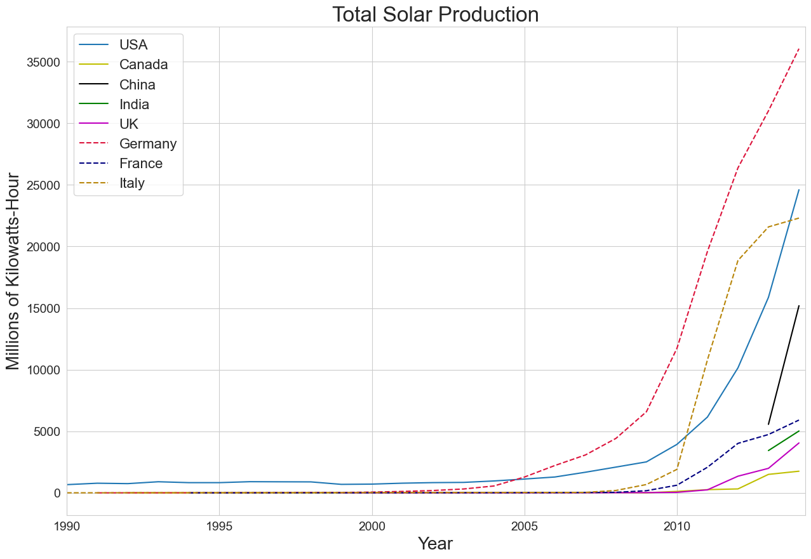
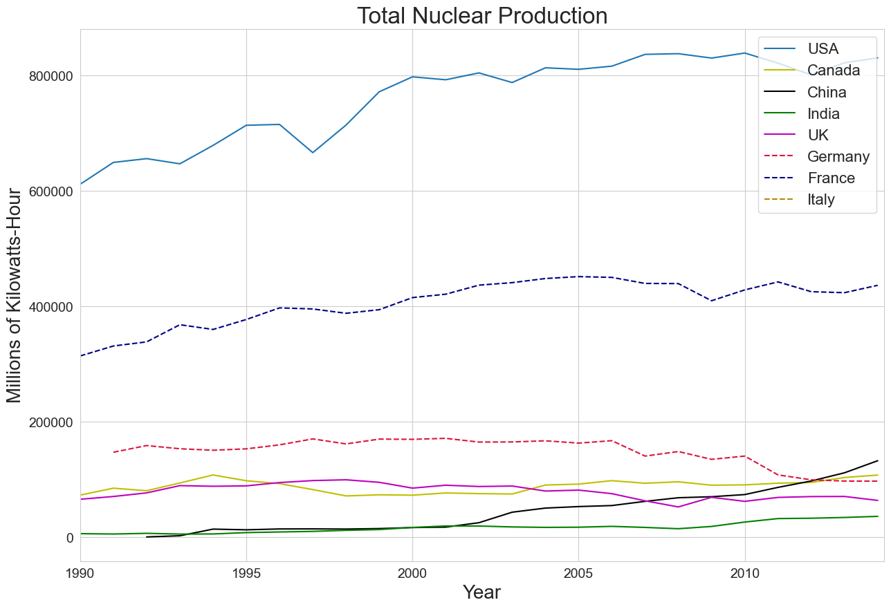

# ***Statiscal analysis of renewable energy consumption worldwide and how renewable energy is being developed and utilized in Viet Nam.***

- [***Statiscal analysis of renewable energy consumption worldwide and how renewable energy is being developed and utilized in Viet Nam.***](#statiscal-analysis-of-renewable-energy-consumption-worldwide-and-how-renewable-energy-is-being-developed-and-utilized-in-viet-nam)
  - [***Abstract***](#abstract)
  - [***Introduction***](#introduction)
  - [***Technology used***](#technology-used)
  - [***Renewable energy and its complication***](#renewable-energy-and-its-complication)
    - [***Wind energy***](#wind-energy)
    - [***Solar energy***](#solar-energy)
    - [***Nuclear Energy***](#nuclear-energy)
    - [***Hydropower***](#hydropower)
  - [***Viet Nam's electricity production***](#viet-nams-electricity-production)
  - [***Prediction for the future***](#prediction-for-the-future)

## ***Abstract***
The energy production process has been mostly depends on fossil fuel during the past 100 years, which leads to the global warming phenomenon. However,  with the recent surge in clean and sustainable power production and consumption, it might be able to help reduce the amount of greenhouse gases being emitted to the environment. This report will mainly focus in renewable sources of energy and low-carbon electricity production. The graphs and statistics will be generated by using the data from the United Nations to visualize the energy production and consumption trend. The report will also take a closer look at Viet Nam's energy statistics to see how it's catching up to the developed country of the world. 

## ***Introduction***
Electricity is the key component of the economic infrastructure of every region as it has become the core part of everyday life. Electricity consumption is increased due to industrial development in developing countries and due to advancements in various sectors. Electricity is produced from both renewable sources (like Wind, solar and Hydel energy etc.) and non-renewable sources (like coal, natural gas, oil, nuclear energy etc.). Even though there are significant advancements in renewable energy production, we still need to rely on non-renewable sources for electricity production as mentioned above.

For this report, i use the dataset from United Nations on energy consumption and production from 1990 to 2014. https://www.kaggle.com/datasets/unitednations/international-energy-statistics/data. Even though this dataset is outdated, i couldn't find another dataset from reputable sources that contains latest energy information. 

Before extracting the data to visualize and generate report, i have done some preprocessing to the data to clean up the data and makes the column name and its data less ambigious. The preprocessing i have done contain: 
- Split commodity_transaction column into commodity, transaction_type and additional_transaction_info. Turn all the strings into lowercase in those respective columns. Fix punctuation error on transaction_type column ('transformation' instead of 'transformatin', remove trailing whitespaces, turns 'non energy uses' into 'consumption for non-energy uses').
- Split unit column into metrics and calculation_unit. Turn all the strings into lowercase in those respective columns. Remove all traling whitespaces and excess whitespace. 

The countries that i have chosen in this report consist of: United States of America, Canada, China, India, United Kingdom, Germany, France, Italy and Viet Nam. Outside of Viet Nam, these are countries that has one of the largest GDP in the world. Using the data from these developed countries, we can see the data with the best case scenario of energy statistics and predict the trend of other developing countries.  

## ***Technology used***
This project uses Python as programming language. To process and visualize the data, i also use Pandas and Matplotlib library, which are built on top of Python programming language.
- Pandas is a fast, powerful, flexible and easy to use open source data analysis and manipulation tool.
- Matplotlib is a comprehensive library for creating static, animated, and interactive visualizations.

Folder structure
- input: Stores input file and questionnaire guidelines. Both are provided from the UN when download the dataset.
- output: Stores cleaned and processed data csv files along with all the images of the graphs. [Wind](/output/wind_energy_data.csv) stores wind data. [Solar](./output/solar_energy_data.csv) stores solar data. [Hydro](./output/hydro_energy_data.csv) stores hydropower data. [Nuclear](./output/nuclear_energy_data.csv) stores nuclear data. Finally, [VietNam](./output/vn_energy_data.csv) stores data from Viet Nam electrical generation.
- [preprocess](./preprocess/cleaning_commodities.py): Contains Python preprocess script that clean up the data.
- [process_data](./process_data/electricity_energy.py): Contains Python script that process data by types of electricity production and visualize it to graphs. 

## ***Renewable energy and its complication***
Renewable energy comes from sources that replenish naturally and continually within a human lifetime. Renewable energy is often called sustainable energy. Major sources of renewable energy include solar, wind, hydroelectric, tidal, geothermal and biomass energy, which is derived from burning plant or animal matter and waste.

We all know that renewable energy is good for the environment, reduce greenhouse gases emission, which reduces the global warming phenomenon. However, renewable energy cannot be used solely as the main energy production method of a country due to the intermittent of it. For example, wind turbines do not produce power when the wind does not blow and solar panel cannot produce electricity in a cloudy day. Therefore, we have to use a source of low-carbon-electricity as a backup. There are two main sources of low-carbon-electricity which are hydropower and nuclear energy. 

### ***Wind energy***
Wind power converts wind - the movement of air - into stored power by turning turbines and converting mechanical energy into electricity. Wind farms can be built both on land and offshore. They work well wherever wind is strong and reliable. Wind energy is a clean, green and renewable resource and turbines can be placed on farmland with minimal disruption. It has the lowest carbon footprint of all renewable energy sources. However, wind power also got its downsides. Like any infrastructure, there is an upfront establishment cost and ongoing maintenance fees. These are even higher if wind farms are built offshore. Turbines have a reputation for being noisy and poorly sited wind farms can be dangerous to some wildlife.

***Wind energy data***
<figure>
  
</figure>

From the graph, the USA clearly was in the lead at more than 180000 million kilowatt-hours, with a significant increase during the period from 2007 onward. China's data only appears from 2010. However, at close to 45000 million kilowatt-homarurs in 2010, China increased its wind power capacity rapidly to 156000 million in 2014. That also made it the country with the second highest electricity production by wind. The other countries in the list produced around 20000 to 30000 million range, with Germany as the only exception at 57000 million. Viet Nam was still in the early phase of wind power at only 300 million kilowatt-hours.

### ***Solar energy***
Solar power captures energy (radiation) from the Sun and converts it into electricity, which is then fed into a power grid or stored for later use. Although places near the equator receive the most solar energy, solar panels can generate electricity anywhere that gets sunlight. Solar energy is renewable, clean, increasingly efficient and has low maintenance costs. Once established, it can dramatically reduce the price of generating electricity. Despite having multiple advantages, solar power also got its own drawbacks. Setting up a solar array is costly and there are expenses involved with energy storage. Solar panels can take up more land than some other types of renewable energy and performance depends on the availability of sunlight. The mining and processing of minerals needed to make the panels can pollute and damage the environment. 

***Solar energy data***
<figure>
  
</figure>

### ***Nuclear Energy***
Nuclear energy is not considered renewable due to the finite of radioactive material that's being used. In my opinion, nuclear energy can be considered as clean since it does not produce greenhouse gases. Furthermore, nuclear energy's land footprint is small, instead of needing land to place solar panel or build a reservoir, nuclear energy powerplant requires less space. However, nuclear energy is not without its issues. Most notably, it produces radioactive waste that must be transported safely to long-term storage, where it will not be disturbed for tens of thousands of years until the material is no longer a danger to human health or the environment.  

***Nuclear energy data***
<figure>
  
</figure>

From the graph of nuclear energy, we can clearly see that USA produced the most electricity from the list at approximately 840000 million killowatt-hours in 2010. France was in the second place with around 441000 million kilowatt-hours in 2003. From the recent news, USA will keep its first position because there are plans to create multiple nuclear powerplants in the future. This is the same for France as well, France plans to introduce six to eight nuclear powerplants from 2024 to 2050. China was also on the rise as it had been creating more and more powerplants recently. However, Germany's nuclear energy production is on the decline from 2010 onward, from the German news, Germany gonna shut down its last nuclear powerplant in 2023, which makes German's energy production depends on fossil fuels and renewable energy only. 

### ***Hydropower***
Hydropower currently is the largest low-carbon-electricity and provides around 17% of the world's energy . It uses the flow of water, often from rivers and lakes controlled by a dam, to turn turbines and power generators, creating electricity. Hydropower works best for regions with reliable rainfall and large, natural water reservoirs. Hydroelectricity is dependable and renewable for as long as there is rainfall or flowing water. Reservoirs can offer additional benefits, such as providing drinking water, irrigation and recreational opportunities, including swimming or boating. However, hydropower plants take up a lot of room and aren't suited to all climates. They are susceptible to drought. Creating artificial water reservoirs can harm biodiversity in natural water systems

***Hydro energy data***
<figure>
  
</figure>

Looking at the hydropower graph, China produced the most hydropower out of the all  China's hydropower is on the rise since 1990 all the way to 2014, with a sharp increase from 0.3 billion kilowatt-hours in 2003 to more than 1 billion in 2014. The second and third country in electricity production by hydropower was Canada and USA. Meanwhile, Viet Nam's number was not too bad comparing to other developed countries in the list. This is the result of Viet Nam's government focusing on making hydropower as its main source of elecrtical generation. More and more hydro powerplants are being built and put into service year after year. Surprisingly, United Kingdom produced the least amount of hydropower with just only 9200 million kilowatt-hours in 2009.

## ***Viet Nam's electricity production***

***Viet Nam electricity data***
<figure>
  
</figure>

By the graph we can clearly see that Viet Nam's power mostly consisted of thermal energy and hydropower. However, thermal energy in Viet Nam is not geothermal but it's heat generated by burning fossil fuel. Thermal energy accounted for more than 50% of electricity. In 2014, Viet Nam produced 141000 million kilowatt-hours in total, more than 84000 million kilowatt-hours was created by thermal energy, 61000 million from hydropower and the rest came from wind power. 

Clearly, in 2014, Viet Nam had not adopted solar energy and wind power was only on a small scale even though researches shows that Viet Nam got great potential for wind and solar energy. With its long coastline, wind is easily harvested by gusts blowing constantly from sea to land in daytime and reverse in night time. With geographic position close to the equator, the amount of sunlight Viet Nam receives yearly is enormous. Moreover, land from the middle and southern part of Viet Nam got constant sunlight year round. 

However, there are a lot of things have changed since 2014. Here are several things
- Due to environment impact, multiple hydropower plans have been cancelled. Even though hydropower produces 0 carbon emission during its operational process, building a hydro power plant destroys rainforests, disrupts people's livelihood, causes problem in irrigation and impact flood regime greatly. Several dam failures which costs several lives and billions of VND did not help the case of hydropower either. 
- However, the amount of fossil fuels (mostly coal) being used to generate electricity has been increasing overtime. This is the result of the reduction in hydropower plants and renewable energy sources is not sufficient yet. 
- The progress of renewable energy (includes solar, wind and biomass) in Viet Nam has been increasing steadily throughout the years. The government has introduced multiple support mechanisms for renewable energy types. By the end of 2020, wind and solar combined had a combined share of 10% of Viet Nam's elecrtical generation. However, existing capacity is being under-utilized due to lack of electric transmission capacity of the power grid. 

The sources of all the information presented above are mostly in newspapers. Even thought those are reputable newspapers, the credibility of the sources cannot compare to data from the United Nations or research papers.

## ***Prediction for the future***
In my opinion, renewable energy will be widely adopted worldwide. From the trend of the graphs that i have shown above, we can clearly see that renewable energy is the future of elecrtical generation. Fossil fuel usage are slowly reducing around the world, from electric vehicle in transportation to many coal plants are being closed, renewable energy is slowly replacing traditional ways of electricity production.However, with the future of nuclear energy being uncertain, due to many reasons such as geopolitics and technological limitation and hydropower is being phased out because of environmental effects, renewable energy sources will have to rely on solar and wind power. I expect that there will be many solar and wind power plants being built in the near future. But don't be too confident about the progress of going green, we still have to solve the issue regarding the recyclability of solar panels and some environment effects of wind turbines that i have mentioned above.